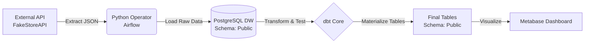

# Automated Retail ELT Pipeline (End-to-End)

**End-to-End Data Engineering Pipeline that orchestrates the ingestion, transformation, and validation of simulated retail sales data, fully deployed in Docker containers.**

---

## Final Result: Compliance Dashboard

*(Metabase Visualization: Automatic comparison of Actual Sales vs Business Objectives)*

---

## Project Description

This project simulates a real-world data environment for a Retail company. The system extracts "live" transactions from a public API, stores them in a Data Warehouse, and transforms them to answer a critical business question: **Which product categories are meeting their monthly sales targets?**

Unlike a traditional ETL, an **ELT (Extract, Load, Transform)** architecture was implemented, leveraging the power of PostgreSQL for heavy processing and **dbt** for data lifecycle management and quality testing.

### Key Features
* **Robust Orchestration:** Scheduled Airflow DAGs with retry handling and dependencies.
* **Data Quality:** "Quality Gates" implemented with dbt tests that halt the pipeline if duplicates or nulls are detected.
* **Idempotency:** The pipeline can be executed multiple times without duplicating data or creating inconsistencies.
* **Infrastructure as Code (IaC):** The entire environment spins up with a single Docker Compose command.

---

## System Architecture

The data flow follows a modular architecture:

