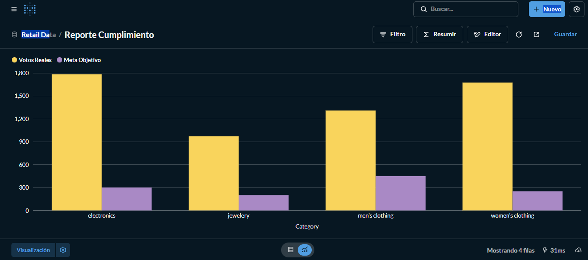
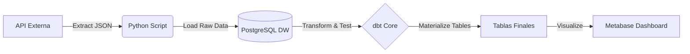

# Automated Retail ELT Pipeline (End-to-End)

**Este proyecto consta de un pipeline de datos robusto que ingesta, transforma y audita datos de ventas retail, diseñado para soportar fallos y garantizar calidad de datos.**

---

## Resultado Final (Dashboard)

*Comparativa de Ventas Reales vs Objetivos de Negocio procesada automáticamente*

---

## Caso de Negocio
El objetivo del proyecto es procesar transacciones diarias de una tienda retail (simulada vía API) para generar un Reporte de Cumplimiento de Ventas. El sistema cruza los datos transaccionales vivos con objetivos estáticos de negocio para determinar qué categorías están cumpliendo sus KPIs.

## Arquitectura del Sistema

El flujo de datos sigue una arquitectura ELT (Extract, Load, Transform) contenerizada en Docker:

